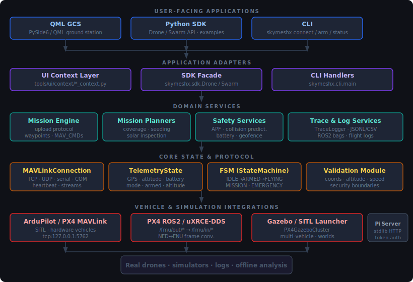

# SkyMeshX

**Research-grade UAV middleware and ground control station for single drones, swarms, agricultural missions, solar inspection, PX4/ROS2 simulation, and field data workflows.**

[](https://github.com/joeldjio/skymeshx/actions)
[](https://codecov.io/gh/joeldjio/skymeshx)
[](https://opensource.org/licenses/MIT)
[](https://www.python.org/downloads/)
[](https://doc.qt.io/qtforpython/)

SkyMeshX combines a Python SDK, a PySide6/QML ground control station, MAVLink control, PX4-native ROS2/uXRCE-DDS integration, mission planning, safety filters, simulation support, and research data tooling in a single coherent package.

> **Safety note:** SkyMeshX can command real vehicles. Test all new workflows in SITL first, then with propellers removed, and only in controlled flight conditions.

---

## Features at a Glance

| Category | Capabilities |
|---|---|
| **Ground control station** | PySide6/QML UI — dashboard, interactive map, swarm panel, mission wizards, safety panel, gimbal/camera, ROS2 bridge, experiment runner, flight log |
| **Core drone SDK** | `Drone` and `Swarm` Python APIs over TCP, UDP, serial, and COM ports |
| **Mission planning** | Manual waypoints, field coverage, **agricultural seeding** with servo/dispenser commands, **solar inspection** with gimbal/camera triggers |
| **Mission safety** | Upload ≠ execute — upload transfers items, Start Mission is the explicit arming/execution step |
| **Swarm coordination** | Multi-drone management, formations (line, V, grid, circle, wedge), leader/follower, APF collision avoidance, distributed task allocation |
| **Safety systems** | APF potential field filter, collision prediction, battery monitoring with predictive RTL, geofence, capability checks |
| **PX4 + ROS2** | uXRCE-DDS bridge, PX4 topic discovery/health, mission upload/monitoring, NED↔ENU frame conversion, bag recording/playback, Gazebo SITL launcher |
| **Camera & gimbal** | Observation UAV model, gimbal pitch/roll/yaw control, live video (UDP/RTSP/MJPEG), thermal settings, camera trigger metadata |
| **Traceability** | Trace bundles, mission WP tracking, topic health exports, JSONL/CSV telemetry, ROS2 bag workflows |
| **Raspberry Pi server** | Stdlib-only lightweight HTTP MAVLink proxy (~20 MB RAM, no numpy/Qt) with token auth and request validation |
| **Hardware-free tests** | Full test suite runs in ~1 s with mocked MAVLink, ROS2, SITL, and hardware |

---

## Quick Start

### 1. Install from source

```bash
git clone https://github.com/joeldjio/skymeshx.git
cd skymeshx

python -m venv .venv

# Windows PowerShell
.\.venv\Scripts\Activate.ps1
# Linux/macOS
source .venv/bin/activate

pip install -e .
pip install -r requirements.txt
# With test dependencies
pip install -e ".[test]"
```

ROS2 support is optional — install your ROS2 distribution (e.g. Humble) plus `px4_msgs` separately.

### 2. Launch the GCS

```bash
python -m tools.ui
# with debug output
python -m tools.ui --debug
```

### 3. Connect to ArduPilot SITL

SkyMeshX defaults to the raw ArduCopter SITL endpoint:

```text
tcp:127.0.0.1:5762   ← raw SITL (default)
tcp:127.0.0.1:5760   ← MAVProxy-aggregated SITL (not default)
```

```bash
sim_vehicle.py -v ArduCopter
python -m tools.ui
# Connect in UI with: tcp:127.0.0.1:5762
```

### 4. Connect to PX4 SITL + ROS2

PX4-native workflows use uXRCE-DDS and ROS2 topics, not MAVLink-over-ROS.

```bash
source /opt/ros/humble/setup.bash
source /path/to/px4_msgs_ws/install/setup.bash

MicroXRCEAgent udp4 -p 8888

cd /path/to/PX4-Autopilot
PX4_UXRCE_DDS_NS=uav_1 make px4_sitl gz_x500
```

Then launch the UI → ROS2 panel → set namespace `uav_1` → Start Bridge.

See [docs/setup/px4-sitl.md](docs/setup/px4-sitl.md) for the full workflow.

---

## Command Line

```bash
skymeshx connect
skymeshx status --port tcp:127.0.0.1:5762
DRONE_PORT=udp:127.0.0.1:14550 skymeshx arm
```

Port resolution order: `--port` flag → `DRONE_PORT` env var → `tcp:127.0.0.1:5762`

---

## Python API Examples

### Single drone

```python
from skymeshx import Drone

drone = Drone("tcp:127.0.0.1:5762")
drone.connect()
drone.arm()
drone.takeoff(10.0)
drone.goto(47.397742, 8.545594, 15.0)
drone.land()
drone.disconnect()
```

### Swarm

```python
from skymeshx import Swarm

swarm = Swarm()
swarm.add("D1", "tcp:127.0.0.1:5762")
swarm.add("D2", "tcp:127.0.0.1:5763")
swarm.add("D3", "tcp:127.0.0.1:5764")

swarm.connect_all()
swarm.arm_all()
swarm.takeoff_all(altitude=10.0)
swarm.formation("v", spacing=5.0, leader="D1", use_apf=True)
swarm.land_all()
swarm.disconnect_all()
```

### Field coverage

```python
from skymeshx.control.field_coverage import (
    CoverageConfig, CoveragePattern, FieldBoundary, FieldCoveragePlanner,
)

boundary = FieldBoundary(corners=[
    (47.397742, 8.545594), (47.397742, 8.546594),
    (47.398742, 8.546594), (47.398742, 8.545594),
])

planner = FieldCoveragePlanner()
planner.set_home_position(47.397742, 8.545594)

config = CoverageConfig(
    pattern=CoveragePattern.PARALLEL_LINES,
    altitude=20.0, line_spacing=10.0, speed=5.0,
)
waypoints = planner.generate_coverage_waypoints(boundary, config)
```

### Seeding mission

```python
from skymeshx.control.seeding_planner import SeedingMissionPlanner, SeedingConfig

planner = SeedingMissionPlanner()
config = SeedingConfig(
    altitude=15.0, speed=5.0, row_spacing=8.0,
    seed_rate=2.0, servo_open_pwm=1900, servo_close_pwm=1100,
)
preview = planner.generate_seeding_mission_with_preview(boundary, config)
print(preview.to_dict()["seedDropPoints"])
```

### Solar inspection

```python
from skymeshx.control.solar_inspection import (
    InspectionConfig, PanelRow, SolarParkInspectionPlanner,
)

rows = [
    PanelRow(start=(48.1370, 11.5750), end=(48.1380, 11.5750), width=2.0),
]
config = InspectionConfig(
    altitude=30.0, speed=3.0,
    gimbal_pitch=-90.0, trigger_distance=8.0,
)
preview = SolarParkInspectionPlanner().generate_solar_mission_with_preview(rows, config)
print(preview.to_dict()["totalImages"])
```

---

## Architecture

SkyMeshX has two public faces: a **Python API** for scripts and research code and a **PySide6/QML ground control station** for operators. Both use the same core planning, safety, telemetry, and transport services.

### System Architecture Diagram



The UI is intentionally a **thin adapter**. QML files do layout and interaction; `tools/ui/context/*.py` validates input, dispatches to Python services, emits Qt signals, and moves blocking work (mission upload, ~50 ms/WP) off the UI thread. Mission planners are hardware-free and can be used without any connected drone.

### API Layer Summary

| Layer | Main modules | Responsibility |
|---|---|---|
| **Public SDK** | `skymeshx.Drone`, `skymeshx.Swarm` | Single-drone and swarm scripting API |
| **UI Context** | `tools/ui/context/*_context.py` | QML slots/properties/signals for every panel |
| **Mission Planning** | `skymeshx.control.*` | Hardware-free waypoint generation and preview |
| **Safety** | `skymeshx.safety.*`, `skymeshx.validation.*` | APF, collision prediction, battery, coordinate validation |
| **Core** | `skymeshx.core.*` | MAVLink connection, FSM, telemetry cache, trace writer |
| **PX4 ROS2** | `skymeshx.ros.*` | uXRCE-DDS bridge, frame conversion, topic health, bag recorder |
| **Simulation** | `skymeshx.simulation.*` | SITL/Gazebo launch profiles, replay helpers |
| **Hardware edge** | `pi/server.py` | Lightweight Pi MAVLink proxy with token auth |

### Main Data Flows

**Telemetry:**
```
Autopilot/SITL → MAVLinkConnection or PX4 ROS2 bridge
  → TelemetryState / bridge topic cache
  → SwarmContext, TelemetryContext, ROS2Context
  → QML panels and map overlays → logs, traces, bags
```

**Command:**
```
QML button or Python API call
  → UI context or Drone/Swarm facade
  → coordinate validation (skymeshx.validation)
  → core command / mission / ROS2 bridge
  → MAVLink command or PX4 ROS2 message
  → FSM and telemetry updates → UI/log/trace feedback
```

**Mission preview → upload → execute:**
```
Field boundary / panel rows / parameters
  → MissionContext.generate*Preview()        [hardware-free]
  → Planner returns preview dict + WP list
  → Operator reviews map overlays and warnings
  → MissionContext.upload*Mission()          [blocks off UI thread]
  → MissionEngine.clear() + add() + upload()
  → Operator presses Start Mission           [explicit arming + execution]
```

---

## Ground Control Station

Launch:
```bash
python -m tools.ui
```

### Panel Overview

| Panel | Key features |
|---|---|
| **Dashboard** | Live telemetry, FSM state, GPS, altitude, speed, battery |
| **Map** | Leaflet map, drone markers/paths, WP drag-and-drop, field boundary drawing, seeding/solar overlays, optional camera PIP |
| **Mission** | Manual WPs, field coverage, seeding wizard, solar inspection wizard, upload/start/pause/abort |
| **Swarm** | Drone selector with type toggle, connected drones list, formation controls, multi-mission targets |
| **Safety** | APF enable/configure, collision visualisation, geofence, battery thresholds |
| **Gimbal/Camera** | Gimbal pitch/roll/yaw, camera trigger, live stream start/stop, thermal settings |
| **ROS2** | PX4 bridge start/stop, topic browser, SITL launcher, bag recorder, trace export |
| **Experiment** | Python script runner, JSON scenario runner, live output |
| **Flight Log** | CSV telemetry charts, ROS2 bag playback with timeline scrubber |

### Drone Type Selector (Swarm Panel)

Every drone added to the swarm has a **type** that controls which features are active:

| Type | Icon | When to use | Unlocks |
|---|---|---|---|
| **Generic** | ⚙ | Standard MAVLink vehicles — all normal flight/mission workflows | Arm, takeoff, land, RTL, waypoints, coverage, seeding, formations, battery monitoring |
| **Observation** | 📷 | Drones with camera/gimbal payload | Everything in Generic **+** Gimbal/Camera panel, Solar Inspection Wizard, live video stream, camera trigger commands in missions, thermal settings, ROS2 depth/thermal topics |

> **Important:** Set the drone type to **Observation** _before_ opening the Solar Inspection wizard or Gimbal panel. The camera detection logic reads the `droneType` flag. A tooltip on each type button explains this in the UI.

---

## Mission Workflows

### Agricultural Seeding

The seeding planner generates parallel coverage rows, seed drop points, and MAVLink servo commands for a seed dispenser payload.

1. Open **Mission → Seeding Wizard**.
2. Draw field boundary on map (or enter coordinates).
3. Configure altitude, speed, row spacing, seed rate, and servo PWM values.
4. Click **Generate Preview** — the map shows flight rows and drop points.
5. Review warnings (battery, row spacing, coverage gaps).
6. Click **Upload Mission** — transfers to vehicle.
7. Click **Start Mission** — arms, takes off, and starts the mission.

See [docs/features/seeding-mission-planner.md](docs/features/seeding-mission-planner.md) for full API and parameter reference.

### Solar Panel Inspection

The solar inspection planner generates row-following missions with gimbal orientation commands and camera trigger points.

**Requires: drone type set to Observation** (camera detection uses this flag).

1. Open **Mission → Solar Inspection Wizard**.
2. Draw or enter panel row start/end coordinates on the map.
3. Configure altitude, speed, gimbal pitch, overlap, camera FOV, and trigger distance.
4. Click **Generate Preview** — the map shows trigger points and image footprint polygons.
5. Review estimates (image count, battery, GSD, storage, coverage area).
6. Click **Upload Mission** → **Start Mission**.

See [docs/features/solar-inspection.md](docs/features/solar-inspection.md) for full API and preview contract.

### Field Coverage

Pure area-coverage missions for mapping, spraying, or inspection of rectangular and polygon-bounded fields.

See [docs/features/field-coverage-planning.md](docs/features/field-coverage-planning.md).

---

## PX4, Gazebo, ROS2, and Video

Active support for Linux-based PX4 simulation and research workflows:

- **SITL launcher** in the ROS2 panel — model, namespace, world profile, SIH mode, multi-vehicle.
- **ROS2 setup sourcing** — source fields for bridge and SITL sessions in the UI.
- **Topic browser** — PX4 topic discovery, health, and selected topic subscription.
- **Bag recorder** — presets for common topic sets, with playback timeline scrubber.
- **Live video** — optional frames from UDP/RTSP/MJPEG sources through `VideoStreamContext`.
- **Default PX4 Gazebo video ports**: `5600`, `5601`, `5602`, …
- **Trace bundles** exported under `trace_runs/` for offline analysis.

Useful docs:
- [PX4 SITL startup](docs/setup/px4-sitl.md)
- [PX4 mission upload via uXRCE-DDS](docs/setup/px4-mission-upload.md)
- [Frame conventions (NED/ENU/FRD/FLU)](docs/setup/frame-conventions.md)
- [SITL camera stream checklist](docs/testing/sitl-camera-stream.md)
- [SITL bag workflow](docs/testing/sitl-bag-workflow.md)

---

## Safety Systems

### APF Collision Avoidance

Artificial Potential Field filter runs at 20 Hz and modifies goto targets before they reach the flight stack.

- Positions in local NED metres; altitude uses positive z-up (internally inverted).
- Configure via the Safety panel: APF gain, obstacle radius, influence radius.
- Static obstacles added via `safety.addObstacle(x, y, z)`.

### Battery Monitoring

Predictive RTL calculates required return battery based on current distance to home and observed drain rate.

- Configurable critical threshold (default 20 %) and safety margin (default 1.2×).
- Works independently per drone in a swarm.

### Coordinate Validation

All flight commands pass through `skymeshx.validation.coordinates`:
- Latitude: `[-90, 90]`; Longitude: `[-180, 180]`
- Altitude: `[0, max_alt]` (default 120 m, regulatory default)
- Velocity: each component `≤ max_speed` (default 20 m/s)

---

## Raspberry Pi Server

Lightweight MAVLink proxy server for embedded Raspberry Pi deployments.

```bash
python3 pi/server.py --port /dev/ttyUSB0 --baud 57600 --http 8080
python3 pi/server.py --port tcp:127.0.0.1:5760 --http 8080
```

Key properties:
- Stdlib-only HTTP server (~20 MB RAM, < 5 % CPU on Pi 1).
- Dependencies: `pymavlink` + `pyserial` only (no numpy, no Qt).
- Binds to `127.0.0.1` by default (use `--host 0.0.0.0` to expose).
- Bearer token authentication (auto-generated if not provided via `--api-token` or `SKYMESHX_PI_TOKEN`).
- Request body size limited to 8 KB.
- XSS-safe dashboard (DOM-based log rendering).

See [pi/README_PI.md](pi/README_PI.md) for deployment details.

---

## Testing

```bash
pytest tests/                                  # full suite (~1 s)
pytest tests/ -k "not slow"                   # skip slow markers
pytest tests/test_solar_inspection.py -v       # single module
pytest tests/security/ -v                      # security test suite
```

SITL smoke tests are opt-in:
```bash
SITL_AVAILABLE=1 pytest tests/test_sitl_smoke.py -v
```

The default suite runs without real MAVLink, ROS2, PX4, Gazebo, cameras, or drones — all external dependencies are mocked via [`tests/conftest.py`](tests/conftest.py).

---

## Repository Map

| Path | Purpose |
|---|---|
| [`skymeshx/core`](skymeshx/core) | MAVLink connection, telemetry state, FSM, trace logger |
| [`skymeshx/sdk`](skymeshx/sdk) | High-level `Drone` and `Swarm` APIs |
| [`skymeshx/control`](skymeshx/control) | Mission engine, coverage, seeding, solar inspection |
| [`skymeshx/safety`](skymeshx/safety) | APF, collision prediction, battery, perception safety |
| [`skymeshx/validation`](skymeshx/validation) | Coordinate, altitude, and velocity validators |
| [`skymeshx/ros`](skymeshx/ros) | PX4 ROS2 bridge, frame conversion, bag recorder |
| [`skymeshx/simulation`](skymeshx/simulation) | SITL, PX4 Gazebo launcher, replay helpers |
| [`tools/ui`](tools/ui) | PySide6/QML ground control station |
| [`pi`](pi) | Raspberry Pi lightweight HTTP MAVLink proxy |
| [`tests`](tests) | Hardware-free unit and integration tests |
| [`tests/security`](tests/security) | Security-specific test suite |
| [`docs`](docs) | API, setup, feature, UI, security, and testing docs |

---

## Key Conventions

| Convention | Rule |
|---|---|
| **Default MAVLink endpoint** | `tcp:127.0.0.1:5762` (raw SITL, not MAVProxy) |
| **Upload ≠ Execute** | `upload*Mission()` transfers items; `startMission()` arms and executes |
| **Mission upload is blocking** | `MissionEngine.upload()` runs off the UI thread (~50 ms/WP) |
| **PX4 ROS2 topics** | PX4 → ROS2: `/fmu/out/*`; ROS2 → PX4: `/fmu/in/*` |
| **Frame conventions** | PX4/MAVLink = NED/FRD; ROS2 = ENU/FLU — convert at boundaries |
| **ROS2 context** | Use `acquire_ros()` / `release_ros()`, never call `rclpy.init()` directly |
| **Drone type for cameras** | Set type to **Observation** before opening Solar Inspection or Gimbal panel |
| **Optional dependencies** | Core imports must not require UI, ROS2, SITL, or hardware packages |
| **Tests are hardware-free** | Use mocks and fixtures from `tests/conftest.py` |

---

## Documentation Map

| Topic | Document |
|---|---|
| Complete feature overview | [docs/features/complete-feature-description.md](docs/features/complete-feature-description.md) |
| UI user guide | [docs/ui/ui-user-guide.md](docs/ui/ui-user-guide.md) |
| API overview | [docs/api/overview.md](docs/api/overview.md) |
| Full API reference | [docs/api/reference.md](docs/api/reference.md) |
| Installation | [docs/setup/installation.md](docs/setup/installation.md) |
| PX4 SITL | [docs/setup/px4-sitl.md](docs/setup/px4-sitl.md) |
| PX4 mission upload | [docs/setup/px4-mission-upload.md](docs/setup/px4-mission-upload.md) |
| Frame conventions | [docs/setup/frame-conventions.md](docs/setup/frame-conventions.md) |
| Field coverage | [docs/features/field-coverage-planning.md](docs/features/field-coverage-planning.md) |
| Seeding missions | [docs/features/seeding-mission-planner.md](docs/features/seeding-mission-planner.md) |
| Solar inspection | [docs/features/solar-inspection.md](docs/features/solar-inspection.md) |
| Battery monitoring | [docs/features/battery-monitoring.md](docs/features/battery-monitoring.md) |
| Collision prediction | [docs/features/collision-prediction.md](docs/features/collision-prediction.md) |
| Swarm coordination | [docs/features/swarm-coordination.md](docs/features/swarm-coordination.md) |
| Security remediation | [docs/security/SECURITY_REMEDIATION_PLAN.md](docs/security/SECURITY_REMEDIATION_PLAN.md) |
| CI and test strategy | [docs/testing/ci-cd-guide.md](docs/testing/ci-cd-guide.md) |
| Release checklist | [docs/release/checklist.md](docs/release/checklist.md) |
| Raspberry Pi deployment | [pi/README_PI.md](pi/README_PI.md) |

---

## Licensing

The core project is licensed under MIT. The graphical GCS uses PySide6/Qt for Python under LGPL v3 through dynamic linking.

- [LICENSE](LICENSE)
- [THIRD_PARTY_LICENSES.txt](THIRD_PARTY_LICENSES.txt)
- [NOTICE.txt](NOTICE.txt)

---

## Project Status

SkyMeshX is **alpha-stage research software**. Core APIs, hardware-free tests, safety primitives, seeding previews, solar inspection previews, and many UI workflows are usable. PX4/Gazebo simulation, live camera/video, advanced trace workflows, and mission execution validation are under active development.

Repository: <https://github.com/joeldjio/skymeshx>
